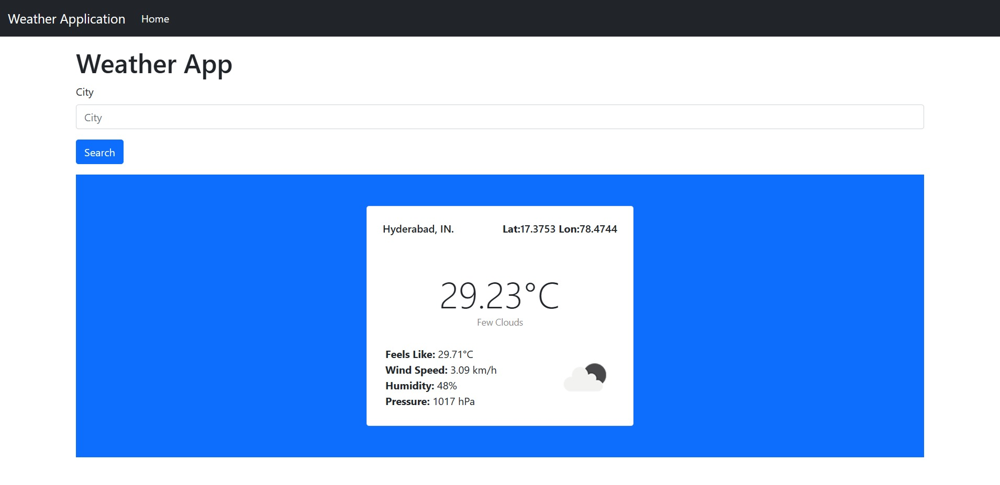

# Weather Application

Crafting a Dynamic Weather Application:
Unleashing the Power of Django and Python with API Integration to Fetch Real-Time Weather Data Based on City Names.

## Installing

### Clone the project

```bash
git clone https://github.com/shivatejaburle/weather-app
cd weather-app
```

### Setup your Virtual Environment
```bash
pip install virtualenv
virtualenv venv
# For Windows
venv\Scripts\activate   
# For Mac
source venv/bin/activate 
```

### Install dependencies
```bash
pip install -r requirements.txt
```

### Environment Settings

Create `weather-app/.env` to store your API Key.

```bash
WEATHER_API_KEY = "Your-API-Key"
```

### Apply migrations

```bash
python manage.py migrate
```
### Collect static files (only on a production server)

```bash
python source/manage.py collectstatic
```

### Running a development server

Just run this command:

```bash
python manage.py runserver
```

## Screenshots

| Landing Page |
| ------------------------------------------------------|
||

| Results |
| ------------------------------------------------------|
||

| Show error message when city not found. |
| ------------------------------------------------------|
||

